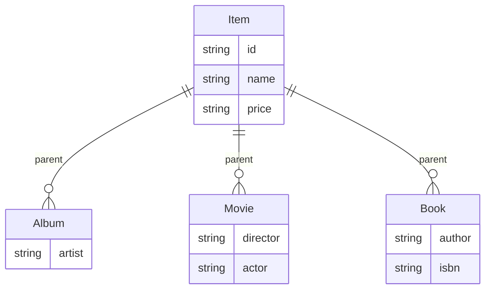
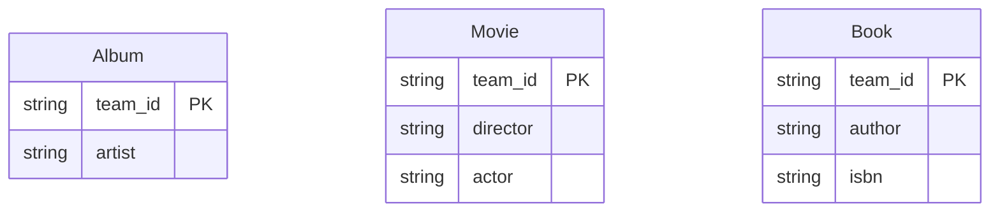

# 목차
- [목차](#목차)
- [1. 상속관계 매핑](#1-상속관계-매핑)
  - [1.1 조인 전략](#11-조인-전략)
    - [1.1.1 join Annotation](#111-join-annotation)
    - [1.1.2 jpa create table](#112-jpa-create-table)
  - [1.2. 단일 테이블 전략](#12-단일-테이블-전략)
    - [1.2.1 Annotation](#121-annotation)
    - [1.2.2 jpa create table](#122-jpa-create-table)
  - [1.3. 구현 클래스마다 테이블 전략](#13-구현-클래스마다-테이블-전략)
    - [1.3.1 Annotation](#131-annotation)
    - [1.3.2 jpa create table](#132-jpa-create-table)
- [2. Mapper Superclass](#2-mapper-superclass)

# 1. 상속관계 매핑

## 1.1 조인 전략

장점
- 테이블 정규화
- 외래 키 참조 무결성 제약조건 활용가능
- 저장공간 효율화

단점
- 조회시 조인을 많이 사용, 성능 저하
- 조회 쿼리 복잡
- 데이터 저장 시 INSERT 2번 호출

참조
- **성능**이 많이 저하 되지는 않는다.

### 1.1.1 join Annotation

- 부모테이블
```java
@Entity
@Inheritance(strategy = InheritanceType.JOINED)
@DiscriminatorColumn
public abstract class 클래스명 {
    
}
```

- 자식 테이블
```java
@Entity
public class 자식 extends 부모 {
    
}
```

### 1.1.2 jpa create table
```java
create table MainItem (
    DTYPE varchar(31) not null,
    itemId bigint not null,
    name varchar(255),
    price integer not null,
    primary key (itemId)
)

create table Book (
    ISBN varchar(255),
    author varchar(255),
    itemId bigint not null,
    primary key (itemId)
)

create table Movie (
    actor varchar(255),
    director varchar(255),
    itemId bigint not null,
    primary key (itemId)
)

create table Album (
    artist varchar(255),
    itemId bigint not null,
    primary key (itemId)
)
```


## 1.2. 단일 테이블 전략

장점
- 조인이 필요 없으므로 일반적으로 조회 성능이 빠름
- 조회 쿼리가 단순함 

단점
- 자식 엔티티가 매핑한 컬럼은 모두 null 허용
- 단일테이블에 모든것을 저장하므로 테이블이 커질 수 있다.
- 상황에 따라서 조회 성능이 오히려 느려질 수 있다.

### 1.2.1 Annotation
- 부모테이블
```java
@Entity
@Inheritance(strategy = InheritanceType.SINGLE_TABLE)
@DiscriminatorColumn
public abstract class 클래스명 {
    
}
```

- 자식 테이블
```java
@Entity
public class 자식 extends 부모 {
    
}
```

### 1.2.2 jpa create table

```sql
create table MainItem (
    DTYPE varchar(31) not null,
    itemId bigint not null,
    name varchar(255),
    price integer not null,
    artist varchar(255),
    ISBN varchar(255),
    author varchar(255),
    actor varchar(255),
    director varchar(255),
    primary key (itemId)
)
```

## 1.3. 구현 클래스마다 테이블 전략
- 해당 전략은 `지양`한다.
- ITEM 테이블은 생성되지 않는다.
  


장점
- 서브 타입을 명확하게 구분해서 처리할 때 효율적
- not null 제약조건 사용 가능

단점
- 여러 자식 테이블을 함께 조회할 때 성능이 느림(UNION SQL 필요)
- 자식 테이블을 통합해서 쿼리하기 어려움

### 1.3.1 Annotation
- 부모테이블
```java
@Entity
@Inheritance(strategy = InheritanceType.TABLE_PER_CLASS)
@DiscriminatorColumn
public abstract class 클래스명 {
    
}
```

- 자식 테이블
```java
@Entity
public class 자식 extends 부모 {
    
}
```

### 1.3.2 jpa create table

```sql
 create table Album (
    itemId bigint not null,
    name varchar(255),
    price integer not null,
    artist varchar(255),
    primary key (itemId)
)
    
create table Book (
    itemId bigint not null,
    name varchar(255),
    price integer not null,
    ISBN varchar(255),
    author varchar(255),
    primary key (itemId)
)

 create table Movie (
    itemId bigint not null,
    name varchar(255),
    price integer not null,
    actor varchar(255),
    director varchar(255),
    primary key (itemId)
)

```

# 2. Mapper Superclass 
- 공통의 매핑 정보가 필요할 때
- 상속관계 매핑은 아니다.
- 엔티티, 테이블과 매핑x
- 조회, 검색 불가능
- 직접 생성해서 생성할 일이 없으므로 추상클래스 권장
- 주로 등록일, 수정일, 등록자, 수정자 같은 전체 엔티티 공통으로 적용하는 정보

```java
@MappedSuperclass
public abstract class BaseEntity {
    public LocalDateTime createDateTime; 
}
```

```java
public class User extend BaseEntity {

}
```
