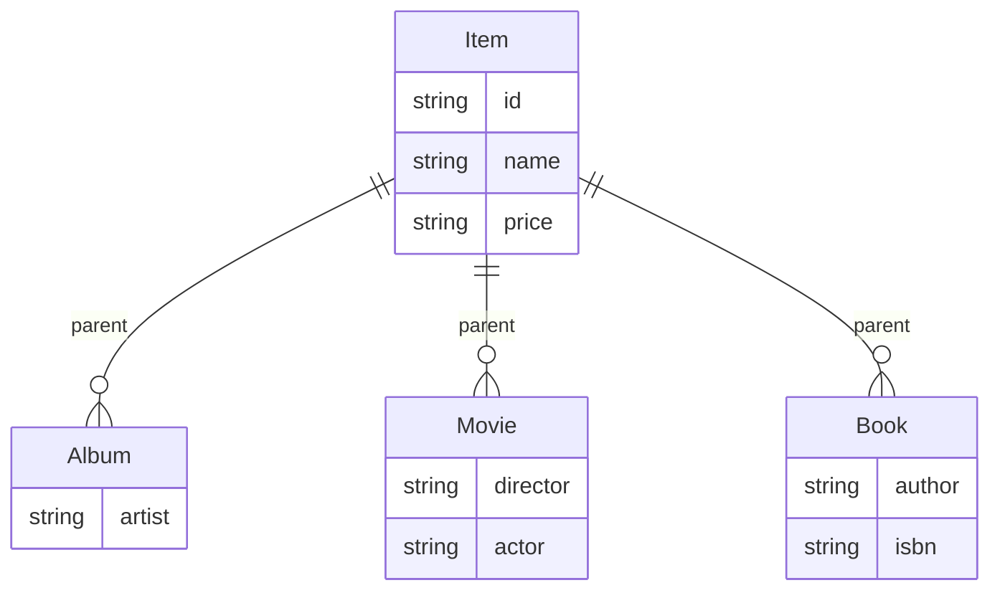

# 1. 상속관계 매핑
## .1 조인 전략

장점
- 테이블 정규화
- 외래 키 참조 무결성 제약조건 활용가능
- 저장공간 효율화

단점
- 조회시 조인을 많이 사용, 성능 저하
- 조회 쿼리 복잡
- 데이터 저장 시 INSERT 2번 호출

참조
- **성능**이 많이 저하 되지는 않는다.

### 1.1.1 join Annotation

- 부모테이블
```java
@Entity
@Inheritance(strategy = InheritanceType.JOINED)
@DiscriminatorColumn
public abstract class 클래스명 {
    
}
```

- 자식 테이블
```java
@Entity
public class 자식 extends 부모 {
    
}
```

### 1.1.2 jpa create table
```java
create table MainItem (
    DTYPE varchar(31) not null,
    itemId bigint not null,
    name varchar(255),
    price integer not null,
    primary key (itemId)
)

create table Book (
    ISBN varchar(255),
    author varchar(255),
    itemId bigint not null,
    primary key (itemId)
)

create table Movie (
    actor varchar(255),
    director varchar(255),
    itemId bigint not null,
    primary key (itemId)
)

create table Album (
    artist varchar(255),
    itemId bigint not null,
    primary key (itemId)
)
```


## 1.2. 단일 테이블 전략

장점
- 조인이 필요 없으므로 일반적으로 조회 성능이 빠름
- 조회 쿼리가 단순함 

단점
- 자식 엔티티가 매핑한 컬럼은 모두 null 허용
- 단일테이블에 모든것을 저장하므로 테이블이 커질 수 있다.
- 상황에 따라서 조회 성능이 오히려 느려질 수 있다.