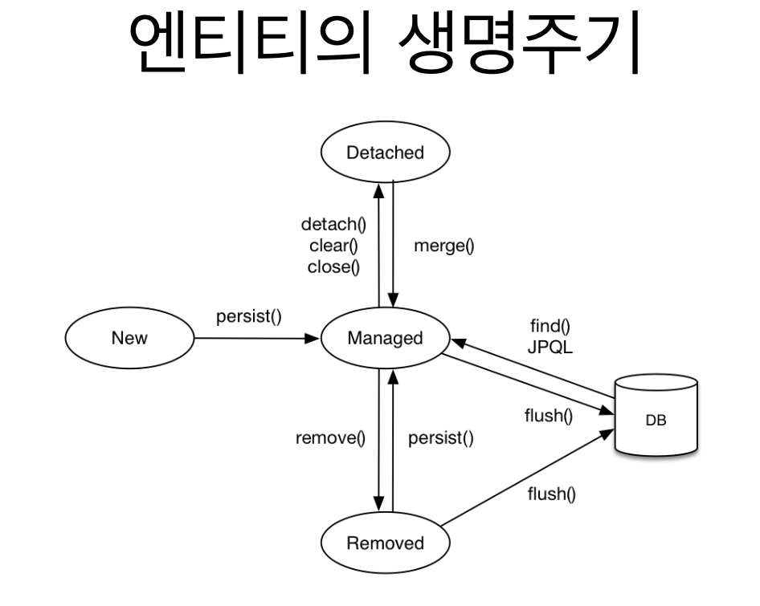

<!-- TOC -->
* [spec.](#spec)
* [1. 영속성 관리](#1--)
  * [1.1. 엔티티의 생명주기](#11--)
  * [1.2. 영속성 컨텍스트의 이점](#12---)
<!-- TOC -->

# spec.
- boot 3.1.1
- gradle 8.1.1
- java 17

# 1. 영속성 관리
## 1.1. 엔티티의 생명주기

**비영속 (new/transient)**
- 영속성 컨텍스트와 전혀 관계가 없는 새로운 상태

**영속 (managed)**
- 영속성 컨텍스트에 관리되는 상태

**준영속 (detached)** 
- 영속성 컨텍스트에 저장되었다가 분리된 상태
 
**삭제 (removed)**  
- 삭제된 상태

## 1.2. 영속성 컨텍스트의 이점
- 1차 캐시 동일성(identity) 보장
- 트랜잭션을 지원하는 쓰기 지연(transactional write-behind)
- 변경 감지(Dirty Checking) 
- 지연 로딩(Lazy Loading)