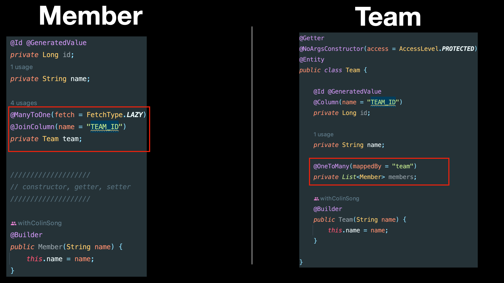

# 다양한 연관관계 매핑


## 1. 다대일

### 1.1. 다대일 단방향


- Member member.team으로 팀 엔티티를 참조할 수 있지만, 반대로 Team에는 Member를 참조하는 필드가 없다.
- 따라서, Member와 Team은 다대일 단방향 연관관계

```java
@ManyToOne
@JoinColumn 
// @JoinColumn(name = "TEAM_ID")
private Team team;
```
- `@JoinColumn` : name을 생략하면 TEAM_TEAM_ID`[객체명_객체컬럼]`이 default
- Member.team 필드로 회원 테이블의 TEAM_ID 외래 키와 매핑하여 관리


1. em.flush(), clear()를 통해 INSERT 구문 실행 및 영속성 컨텍스트 캐시가 비워진 상황이다. 
2. em.find()를 통해  SELECT 구문이 실행
3. findMember.getTeam().getName()을 통해 SELECT 구문 실행 

### 1.2. 다대일 양방향