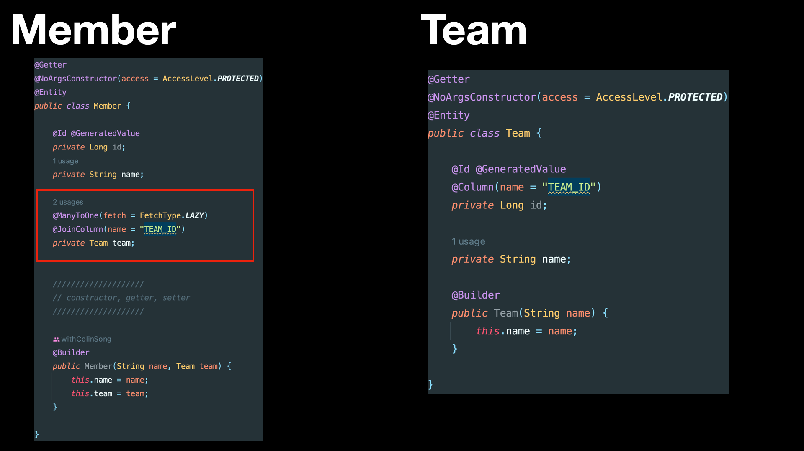
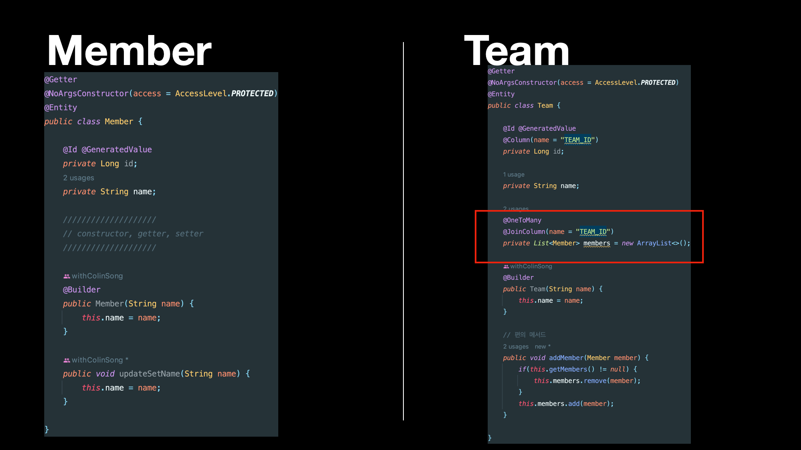

# 다양한 연관관계 매핑

## 1. 다대일

### 1.1. 다대일 단방향



- Member member.team으로 팀 엔티티를 참조할 수 있지만, 반대로 Team에는 Member를 참조하는 필드가 없다.
- 따라서, Member와 Team은 다대일 단방향 연관관계

```java
@ManyToOne
@JoinColumn 
// @JoinColumn(name = "TEAM_ID")
private Team team;
```
- `@JoinColumn` : name을 생략하면 TEAM_TEAM_ID`[객체명_객체컬럼]`이 default
- Member.team 필드로 회원 테이블의 TEAM_ID 외래 키와 매핑하여 관리

#### 1.1.1. 다대일 단방향 Test

1. em.flush(), clear()를 통해 INSERT 구문 실행 및 영속성 컨텍스트 캐시가 비워진 상황이다. 
2. em.find()를 통해  SELECT 구문이 실행
3. findMember.getTeam().getName()을 통해 SELECT 구문 실행 

### 1.2. 다대일 양방향


> 양방향은 외래 키가 있는 쪽이 연관관계의 주인
- 일대다와 다대일 연관관계는 항상 다(N)에 외래키 존재
- 다쪽인(N) Member 테이블이 외래 키를 가지고 있으므로 Member.team이 연관관계 주인
- JPA는 외래 키를 관리할 때 연관관계의 주인만 사용
- 주인이 아닌 Team.members는 조회를 위한 JPQL이나 객체 그래프를 탐색할 때 사용

> 양방향 연관관계는 항상 서로를 참조해야 한다.
- 어느 한 쪽만 참조하면 양방향 연관관계가 성립되지 않는다.
- 항상 서로 참조하게 하려면 연관관계 편의 메소드 작성이 필요하다

#### 1.2.1. 연관관계 편의메서드
- 연관관계 주인이 아닌 곳에서 값을 입력했을 때 db에 값이 정상적으로 저장되지 않는다.
- 객체의 양방향 연관관계는 양쪽 모두 관계를 맺어주어야 순수한 객체 상태에서도 정상적으로 동작한다.
- 양쪽 한 곳에만 작성하거나 양쪽 다 작성할 수 있지만 무한루프의 위험성으로 한 곳에만 작성하는 것이 좋다.
```java
public void addTeam(Team team) {
    if(this.team != null) {
    this.team.getMembers().remove(this);
    }

    this.team = team;
    team.getMembers().add(this);
}
```

#### 1.2.2. 다대일 양방향 Test

- 편의 메서드를 통해 객체 간의 연관관계를 맺어주는 작업이 필요.
- [1.1.1.] when, then은 동일하다.

## 2. 일대다


### 2.1. 일대다 단방향
- 하나의 Team은 여러 Member를 참조할 수 있는데 이때 일대다 관계라고 한다.
- 일대다 단방향 관계는 JPA 2.0부터 지원한다.

### 2.1.1 단점
- 매핑한 객체과 관리하는 외래 키가 다른 테이블에 있다는 점
- 다른 테이블에 외래키가 있으면 연관관계 처리를 위한 update sql을 추가 실행
- 성능 및 관리가 부담스러운 문제
- 다대일 양방향 매핑 권장
- Member의 TEAM_ID 외래 키에 아무 값도 저장되지 않는다.

### 1.2.1. 일대다 단방향 Test


### 2.2. 일대다 양방향


### 2.2.1. 양방향시 주의점
- 일대다 양방향 매핑은 존재하지 않는다.
- 대신 다대일 양방향 매핑을 사용해야 한다.
- 일대다 양방향, 다대일 양방향은 같은 말.
- 양방향 매핑에서 @OneToMany는 연관관계의 주인이 될 수 없다.
  관계형 데이터 베이스 특성상 일대다, 다대일 관계는 항상 다쪽에 외래키가 있기 때문
- @ManyToOne에는 mappedBy 속성이 없다.
- 일대다 단방향 매핑 반대편에 같은 외래 키를 사용하는 다대일 단방향 매핑을 읽기 전용
  으로 처리

## 3. 일대일
- 일대일 관계는 반대쪽도 일대일 관계
- 둘 중 어느곳이나 외래 키 가질 수 있다.

### 3.1. 주 테이블에 외래키 
- 주 객체가 대상 객체를 참조하는 것처럼 주 테이블에 외래 키를 두고 대상테이블 참조
- `장점`: 주 테이블이 외래 키를 가지고 있어 테이블만 확인해도 대상 테이블과 연관관계가 있는지 확인 가능

### 3.1.1 단방향


#### 3.1.1.1. 단방향 Test


### 3.2.1. 양방향


#### 3.2.1.1. 양방향 Test


## 3.2. 대상 테이블에 외래키
- 데이터베이스 개발자들은 보통 대상 테이블에 외래 키를 두는 것을 선호
- `장점`: 관계를 일대일에서 일대다로 변경할 때 테이블 구조 그대로 유지

### 3.2.1. 단방향
- 일대일 관계 중 대상 테이블에 외래 키가 있는 단방향 관계는 JPA에서 지원하지 않는다.

### 3.2.2. 양방향


#### 3.2.2.1. 주의점
- 프록시를 사용할 때 외래 키를 직접 관리하지 않는 일대일 관계는 지연 로딩으로 설정해도 즉시 로딩된다.
- Locker.member는 지연 로딩할 수 있지만, Member.locker는 지연 로딩으로 설정해도 즉시 로딩 된다.
- 프록시의 한계 때문에 발생하는 문제이지만 해결방법이 있다.

# 4. 다대다
- 관계형 데이터베이스는 정규화된 테이블 2개로 다대다 관계를 표현할 수 없다.
- 보통 다대다 관계는 일대다, 다대일 관계로 풀어내는 연결 테이블 사용

## 4.1. 다대다 단방향

1. `JoinTable.name`: 연결 테이블 지정
2. `JoinTable.joinColumns`: 현재 방향인 회원과 매핑한 조인 컬럼 정보를 지정
3. `JoinTable.inverseJoinColumns` : 반대 방향인 상품과 매핑할 조인 컬럼 정보 지정

- Member_Product 엔티티 없이 매핑 완료

## 4.2. 다대다 양방향


### 4.2.1. 단점


- 실무 한계 
- Member_Product에 컬럼을 추가하면 더는 @ManyToMany를 사용할 수 없다.
- 주문 엔티티나, 상품 엔티티에는 추가한 컬럼들을 매핑 할 수 없기 때문이다.

